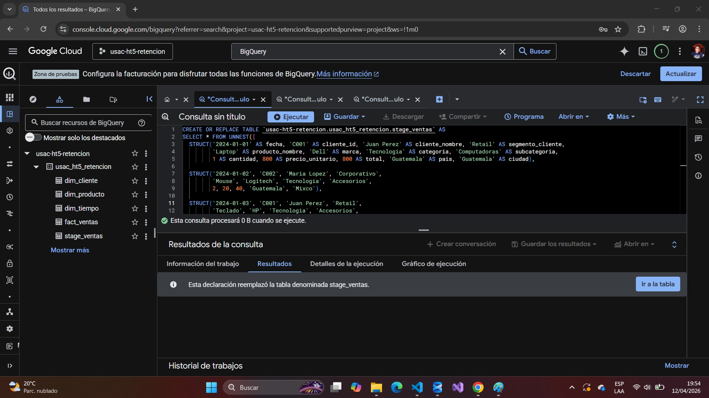
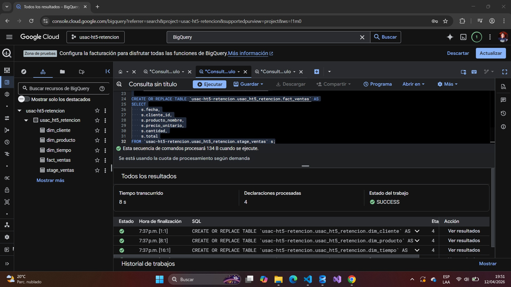
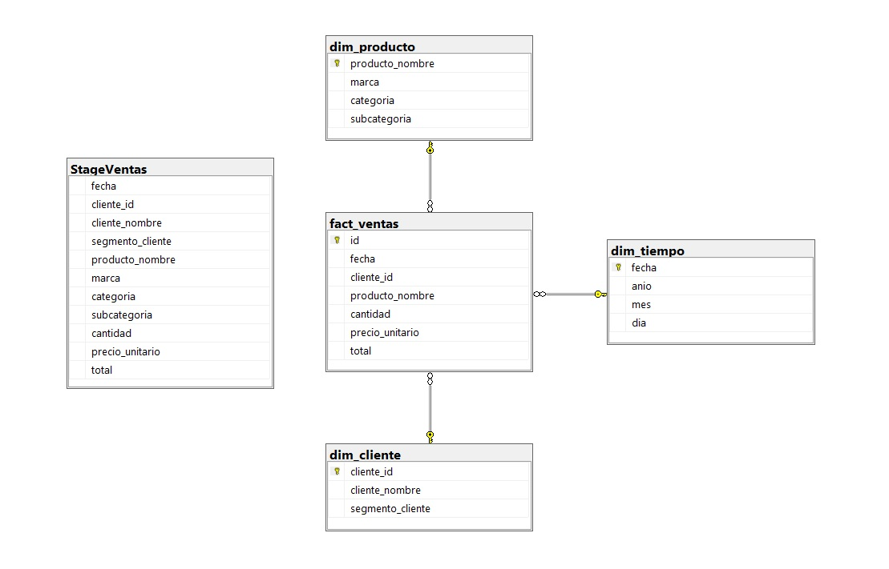
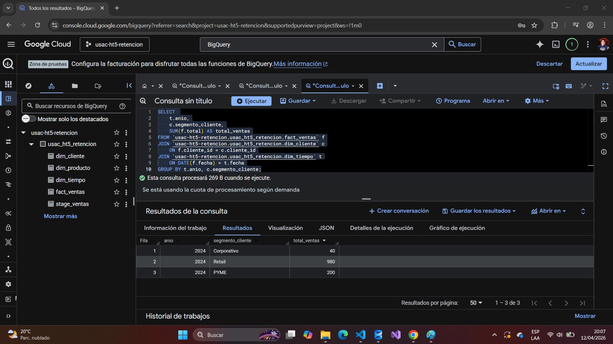
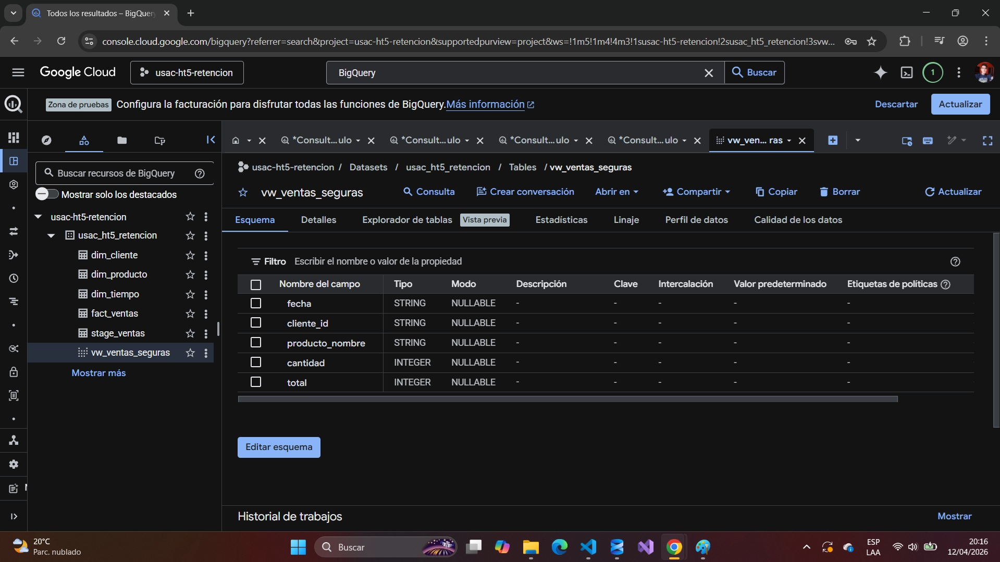
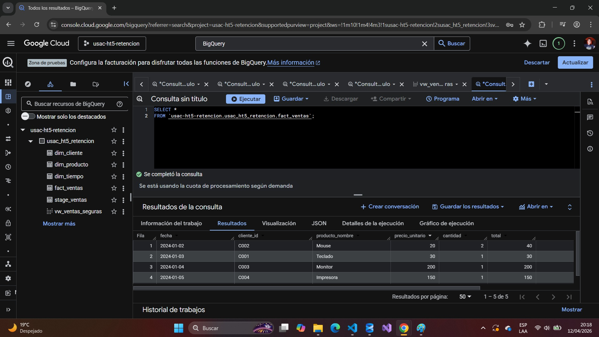
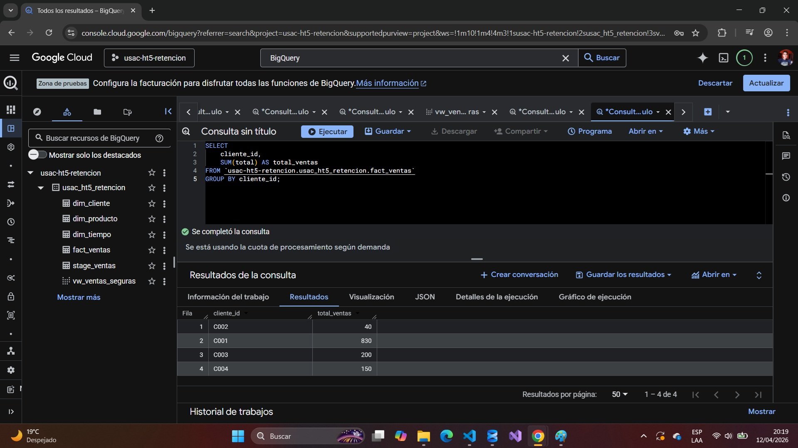
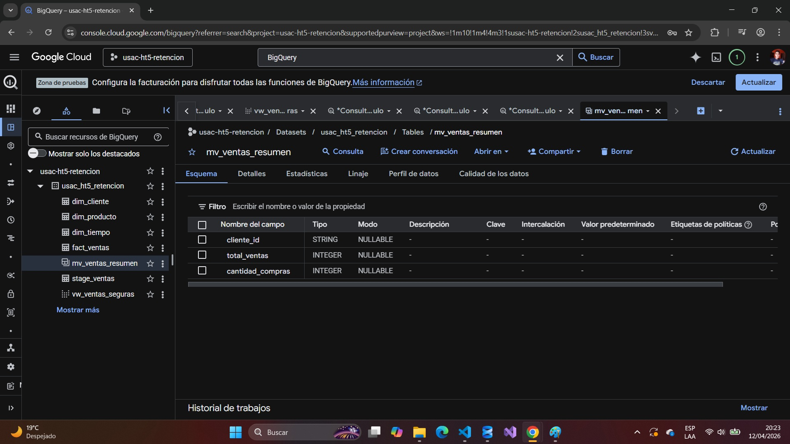

# Hoja de Trabajo 5 - Data Warehouse en BigQuery (GCP)

---

## Objetivo

Desarrollar un proceso ETL y construir un Data Warehouse utilizando **Google BigQuery**, aplicando un modelo dimensional (estrella) que permita realizar consultas analíticas sobre los datos.

---

## Herramienta utilizada

Se utilizó **Google Cloud Platform (GCP)** específicamente:

* BigQuery como motor de almacenamiento y análisis
* SQL estándar para transformación de datos

---

## Proceso ETL

El proceso ETL se simuló directamente en BigQuery mediante consultas SQL.

### 1. Extracción

Los datos fueron simulados manualmente mediante una consulta SQL usando `STRUCT`.

**Creación de la tabla `stage_ventas`**


---

### 2. Transformación

Se realizaron transformaciones para:

* Separar datos en dimensiones
* Normalizar la información
* Convertir tipos de datos (STRING → DATE)

**Creación de dimensiones**


---

### 3. Carga

Se cargaron los datos transformados en:

* Tablas de dimensiones
* Tabla de hechos (`fact_ventas`)

**Tablas creadas en BigQuery**


---

## Modelo de Datos

Se implementó un modelo tipo **estrella**, compuesto por:

### Tabla de Hechos

* `fact_ventas`

  * fecha
  * cliente_id
  * producto_nombre
  * cantidad
  * precio_unitario
  * total

### Dimensiones

* `dim_cliente`

  * cliente_id
  * cliente_nombre
  * segmento_cliente

* `dim_producto`

  * producto_nombre
  * marca
  * categoria
  * subcategoria

* `dim_tiempo`

  * fecha
  * año
  * mes
  * día

**Diagrama del modelo estrella**


---

## Consulta Analítica

Se realizó una consulta para obtener el total de ventas por segmento de cliente:

```sql
SELECT 
    t.anio,
    c.segmento_cliente,
    SUM(f.total) AS total_ventas
FROM `usac-ht5-retencion.usac_ht5_retencion.fact_ventas` f
JOIN `usac-ht5-retencion.usac_ht5_retencion.dim_cliente` c
    ON f.cliente_id = c.cliente_id
JOIN `usac-ht5-retencion.usac_ht5_retencion.dim_tiempo` t
    ON DATE(f.fecha) = t.fecha
GROUP BY t.anio, c.segmento_cliente;
```

**Resultado de la consulta**


---

## Resultados obtenidos

Se logró identificar el total de ventas por segmento:

* Corporativo: 40
* Retail: 980
* PYME: 200

Esto demuestra la utilidad del Data Warehouse para análisis de negocio.

---

## Seguridad de datos y control de acceso

### Identificación de datos sensibles

Dentro del modelo se identificaron posibles datos sensibles:

* `cliente_nombre` → información personal

### Protección aplicada

* Uso de **vistas** para ocultar datos sensibles
* Restricción de acceso a tablas base
* Exposición únicamente de datos necesarios para análisis

---

## Vista segura para usuarios de negocio

Se creó una vista que permite el análisis sin exponer información sensible:

```sql
CREATE OR REPLACE VIEW `usac-ht5-retencion.usac_ht5_retencion.vw_ventas_seguras` AS
SELECT 
    f.fecha,
    f.cliente_id,
    f.producto_nombre,
    f.cantidad,
    f.total
FROM `usac-ht5-retencion.usac_ht5_retencion.fact_ventas` f;
```

**Creación de la vista segura**


---

## Política de acceso por fila (Row-Level Security)

Se puede implementar control de acceso por fila en BigQuery para restringir información según el usuario.

### Ejemplo conceptual

```sql
CREATE ROW ACCESS POLICY filtro_segmento
ON `usac-ht5-retencion.usac_ht5_retencion.fact_ventas`
GRANT TO ("user:analista@empresa.com")
FILTER USING (cliente_id IN (
    SELECT cliente_id 
    FROM `usac-ht5-retencion.usac_ht5_retencion.dim_cliente`
    WHERE segmento_cliente = 'Retail'
));
```

### Justificación

* Permite restringir datos por usuario
* Mejora la seguridad
* Aplica principios de privacidad

---

## Optimización de consultas

### Consulta poco eficiente

```sql
SELECT *
FROM `usac-ht5-retencion.usac_ht5_retencion.fact_ventas`;
```

### Consulta optimizada

```sql
SELECT 
    cliente_id,
    SUM(total) AS total_ventas
FROM `usac-ht5-retencion.usac_ht5_retencion.fact_ventas`
GROUP BY cliente_id;
```

**Comparación de consultas**





---

## Vista materializada

```sql
CREATE MATERIALIZED VIEW `usac-ht5-retencion.usac_ht5_retencion.mv_ventas_resumen`
AS
SELECT 
    cliente_id,
    SUM(total) AS total_ventas,
    COUNT(*) AS cantidad_compras
FROM `usac-ht5-retencion.usac_ht5_retencion.fact_ventas`
GROUP BY cliente_id;
```

### Beneficios

* Mejora rendimiento
* Reduce costos
* Optimiza consultas frecuentes

**Vista materializada creada**



---

## Conclusiones

* BigQuery permite implementar soluciones de Data Warehouse sin infraestructura compleja.
* El modelo dimensional facilita el análisis de datos.
* El proceso ETL puede simularse completamente con SQL.
* La separación en dimensiones mejora el rendimiento de consultas.
* Se implementaron mecanismos de seguridad como vistas y control de acceso.
* Se optimizaron consultas y se utilizaron vistas materializadas para mejorar el rendimiento.

