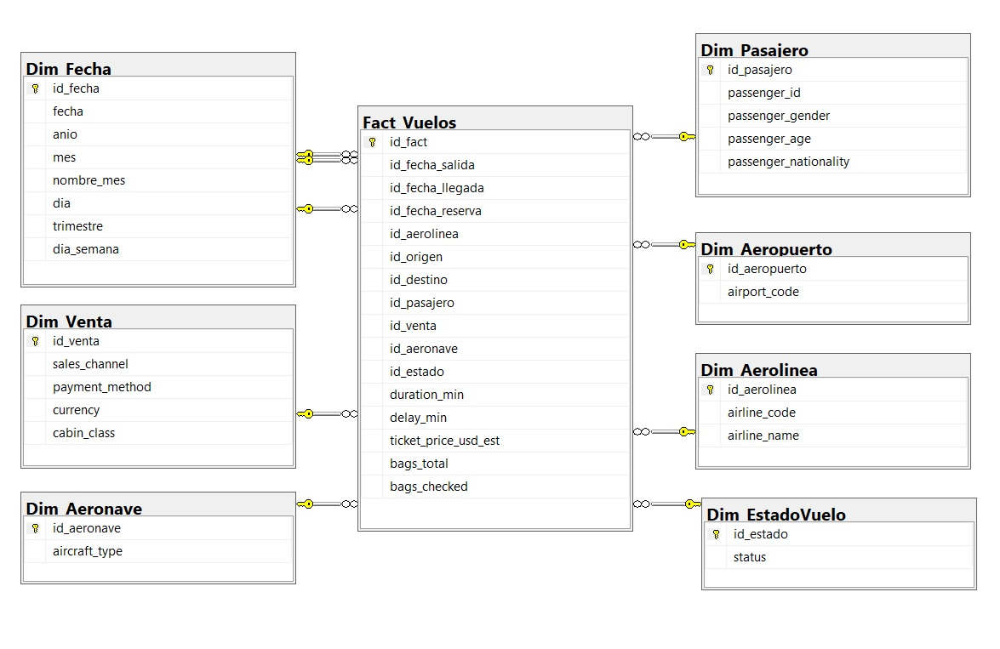

# 📊 Práctica 1 – ETL con Python  
**Seminario de Sistemas 2 – Ingeniería en Ciencias y Sistemas**  
Universidad de San Carlos de Guatemala  

---

## 📌 Descripción del Proyecto

En esta práctica se desarrolló un proceso **ETL** utilizando **Python y SQL Server**, cuyo objetivo es transformar un dataset crudo de vuelos en un **modelo multidimensional tipo estrella** listo para análisis OLAP.

El sistema permite limpiar, normalizar y cargar datos en un Data Warehouse denominado `DW_Vuelos`, soportando consultas analíticas para la toma de decisiones.

---

## 🎯 Objetivo

Implementar un proceso ETL completo que:

- Extraiga datos desde un archivo CSV
- Transforme y estandarice la información
- Cargue los datos en un modelo multidimensional en SQL Server
- Permita ejecutar consultas analíticas sobre la información cargada

---

## 🏗 Arquitectura del Modelo

Se implementó un **modelo estrella** compuesto por:

### 🔹 Tabla de Hechos
- Fact_Vuelos

### 🔹 Dimensiones
- Dim_Fecha
- Dim_Aerolinea
- Dim_Aeropuerto
- Dim_Pasajero
- Dim_Venta
- Dim_Aeronave
- Dim_EstadoVuelo

El modelo incluye:

- Llaves primarias y foráneas
- Restricciones de integridad
- Índices para optimización de consultas OLAP
- Vista analítica `v_CuboVuelos`

---

## 🔄 Proceso ETL

### 1️⃣ Extracción
- Lectura del archivo `dataset_vuelos_crudo.csv`
- Estandarización de nombres de columnas
- Validación inicial de estructura

### 2️⃣ Transformación
- Limpieza de espacios y valores inconsistentes
- Normalización de texto (mayúsculas y formato adecuado)
- Manejo de valores NULL
- Conversión de fechas a formato datetime
- Eliminación de registros inválidos
- Validación de llaves antes de cargar la tabla de hechos

### 3️⃣ Carga
- Carga incremental en tablas de dimensiones
- Generación automática de claves sustitutas (IDENTITY)
- FULL RELOAD en tabla de hechos para evitar duplicados
- Verificación de integridad referencial

---

## 📊 Consultas Analíticas Implementadas

Se desarrollaron consultas SQL para:

- Total de vuelos
- Top 5 destinos más frecuentes
- Distribución de vuelos por género
- Vuelos por aerolínea
- Ingresos totales por aerolínea
- Vuelos por mes y año
- Promedio de duración por aerolínea
- Promedio de retraso por estado
- Vuelos por canal de venta
- Top 5 pasajeros con más vuelos

---

## ⚙ Tecnologías Utilizadas

- Python 3.10+
- Pandas
- SQLAlchemy
- PyODBC
- Microsoft SQL Server
- Modelado Dimensional (Kimball)

---

## 📁 Estructura del Proyecto

```
SS21S2026_201712289/
└── Practica1/
    ├── dataset_vuelos_crudo.csv
    ├── etl_vuelos.py
    ├── queries.sql
    ├── README.md
    ├── requirements.txt
    ├── script.sql
    ├── images/
    └── venv/
```

---

## ▶️ Instrucciones de Ejecución

### 1️⃣ Crear la Base de Datos

Ejecutar el archivo:

script_dw_vuelos.sql

en SQL Server Management Studio.

---

### 2️⃣ Activar entorno virtual

```bash
python -m venv venv
venv\Scripts\activate

Instalar dependencias:

pip install -r requirements.txt
```

### 3️⃣ Ejecutar ETL

```bash
python etl_vuelos.py
```

Si el proceso finaliza correctamente, se mostrará:

```bash
Carga completada correctamente.
```

## 📊 Diseño del modelo multidimensional
