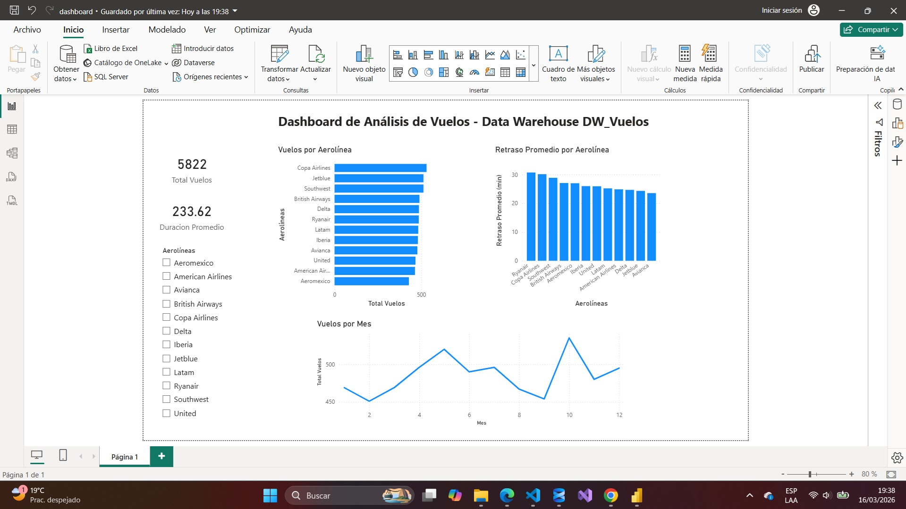
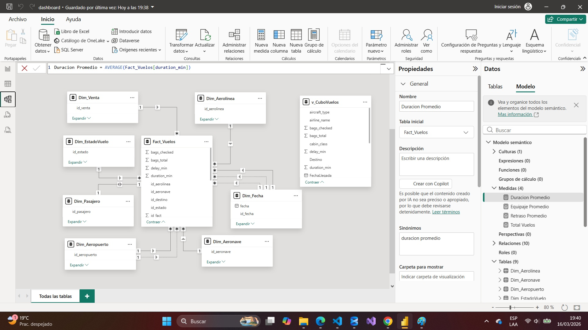
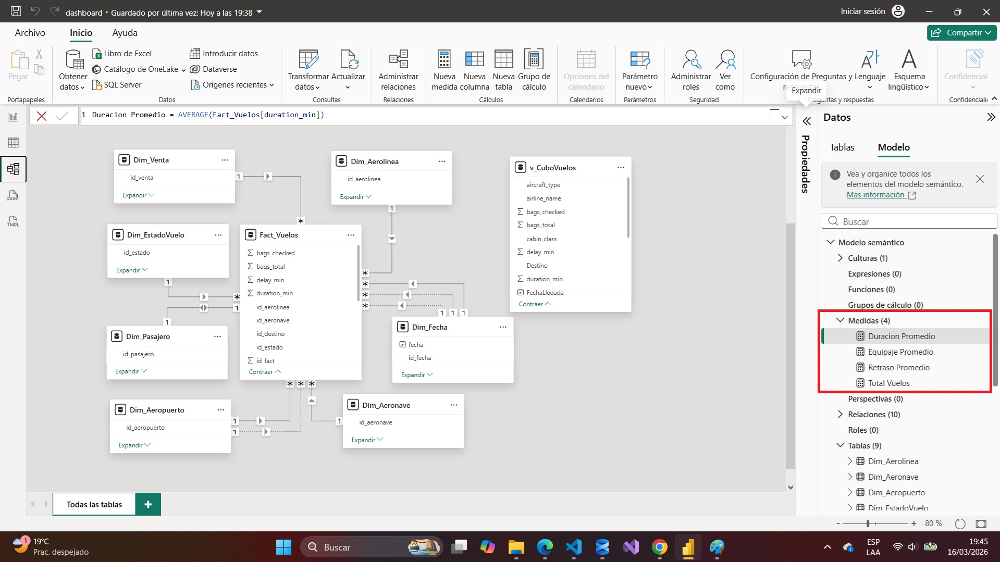
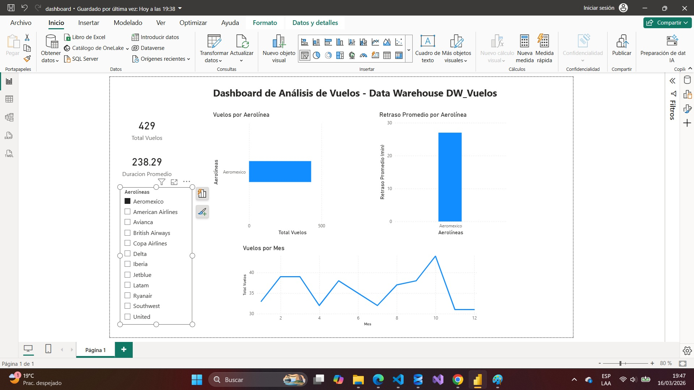

# Dashboard de Análisis de Vuelos – Data Warehouse DW_Vuelos

## Descripción del Proyecto

Este proyecto implementa un proceso completo de **Data Warehousing y Business Intelligence**, cuyo objetivo es transformar datos operacionales de vuelos en información analítica que permita obtener indicadores clave y visualizaciones para el análisis de operaciones aéreas.

El proyecto incluye:

* Proceso **ETL** para limpieza y transformación de datos
* Construcción de un **modelo multidimensional**
* Implementación de **medidas analíticas**
* Creación de un **dashboard interactivo en Power BI**

---

# Objetivo

Desarrollar un **Data Warehouse orientado al análisis de vuelos**, permitiendo:

* Analizar la cantidad de vuelos por aerolínea
* Identificar retrasos promedio en vuelos
* Analizar comportamiento de vuelos a lo largo del tiempo
* Obtener métricas clave para análisis y toma de decisiones

---

# Modelo de Datos

El sistema utiliza un **modelo estrella** compuesto por una **tabla de hechos** y varias **tablas dimensión**.

## Tabla de Hechos

### Fact_Vuelos

Contiene las métricas principales utilizadas para el análisis.

| Campo           | Descripción                        |
| --------------- | ---------------------------------- |
| id_fact         | Identificador único del registro   |
| duration_min    | Duración del vuelo en minutos      |
| delay_min       | Retraso del vuelo en minutos       |
| bags_total      | Total de equipaje                  |
| id_aerolinea    | Llave foránea hacia Dim_Aerolinea  |
| id_aeronave     | Llave foránea hacia Dim_Aeronave   |
| id_origen       | Llave foránea hacia Dim_Aeropuerto |
| id_destino      | Llave foránea hacia Dim_Aeropuerto |
| id_fecha_salida | Llave foránea hacia Dim_Fecha      |

---

## Tablas Dimensión

### Dim_Aerolinea

Contiene información sobre las aerolíneas.

### Dim_Aeronave

Información relacionada con los aviones utilizados.

### Dim_Aeropuerto

Información sobre aeropuertos de origen y destino.

### Dim_Fecha

Permite realizar análisis temporal (año, mes, día).

### Dim_EstadoVuelo

Información sobre el estado del vuelo.

### Dim_Pasajero

Información relacionada con los pasajeros.

### Dim_Venta

Información asociada a ventas o reservas.

---

# Proceso ETL

El proceso ETL fue desarrollado utilizando **Python y Pandas** para transformar los datos antes de cargarlos al Data Warehouse.

Las principales tareas del ETL incluyen:

* Limpieza y normalización de datos
* Manejo de valores NULL
* Control de duplicados
* Validación de llaves
* Transformación de datos
* Carga incremental al Data Warehouse

Este proceso garantiza la **calidad, consistencia e integridad de los datos** utilizados para el análisis.

---

# Medidas DAX Implementadas

Dentro de Power BI se implementaron diversas **medidas DAX (Data Analysis Expressions)** para calcular indicadores clave del sistema.

## Total de Vuelos

Calcula el número total de vuelos registrados.

```DAX
Total Vuelos = COUNT(Fact_Vuelos[id_fact])
```

---

## Duración Promedio del Vuelo

Calcula la duración promedio de los vuelos en minutos.

```DAX
Duracion Promedio (min) = AVERAGE(Fact_Vuelos[duration_min])
```

---

## Retraso Promedio del Vuelo

Calcula el retraso promedio de los vuelos en minutos.

```DAX
Retraso Promedio (min) = AVERAGE(Fact_Vuelos[delay_min])
```

Estas medidas permiten generar los **indicadores clave (KPIs)** utilizados en el dashboard.

---

# Justificación de los KPIs

Los indicadores implementados en el dashboard fueron seleccionados con el objetivo de analizar el desempeño operativo del sistema de vuelos y facilitar la interpretación de los datos dentro del Data Warehouse.

## Total de Vuelos

Este KPI permite conocer el volumen total de operaciones registradas en el sistema.

Su análisis es importante porque permite:

* Medir la actividad general del sistema de vuelos.
* Identificar el nivel de operaciones en el período analizado.
* Servir como referencia para comparar otras métricas del sistema.

---

## Duración Promedio de Vuelo

Este indicador permite analizar el tiempo promedio que duran los vuelos registrados en el sistema.

Su importancia radica en que permite:

* Evaluar la eficiencia operativa de los vuelos.
* Analizar posibles variaciones en la duración de los vuelos.
* Comparar el comportamiento de diferentes aerolíneas.

---

## Retraso Promedio de Vuelo

Este KPI permite identificar el tiempo promedio de retraso en los vuelos registrados.

Es un indicador clave porque:

* Permite evaluar la puntualidad de las operaciones aéreas.
* Facilita la identificación de aerolíneas con mayores retrasos.
* Ayuda a detectar posibles problemas operativos dentro del sistema de vuelos.

---


# Visualizaciones Implementadas

## Vuelos por Aerolínea

Permite identificar qué aerolíneas tienen mayor volumen de vuelos.

## Retraso Promedio por Aerolínea

Permite analizar qué aerolíneas presentan mayores retrasos promedio.

## Vuelos por Mes

Permite observar el comportamiento temporal de los vuelos a lo largo del año.

---

# Interactividad del Dashboard

El dashboard incluye un **segmentador por aerolínea**, que permite filtrar dinámicamente todas las visualizaciones y analizar el comportamiento de cada aerolínea de forma individual.

---

# Captura del Dashboard









---

# Interpretación de Resultados

A partir del dashboard se pueden obtener diversos insights, por ejemplo:

* Identificar las aerolíneas con mayor número de vuelos.
* Detectar aerolíneas con mayores retrasos promedio.
* Analizar la variación mensual en la cantidad de vuelos.
* Evaluar la duración promedio de los vuelos.

Este tipo de análisis facilita la identificación de patrones operacionales dentro del sistema de vuelos.

---

# Herramientas Utilizadas

* Python
* Pandas
* SQL
* Power BI
* GitHub

---

# Conclusiones

La implementación de un **Data Warehouse** permitió estructurar la información operacional de vuelos en un modelo optimizado para análisis.

Mediante el uso de **Power BI**, fue posible transformar los datos en visualizaciones claras e interactivas que facilitan la exploración de información y la identificación de patrones en los datos.

Este proyecto demuestra cómo las herramientas de **Business Intelligence** permiten apoyar procesos de análisis y toma de decisiones basados en datos.

