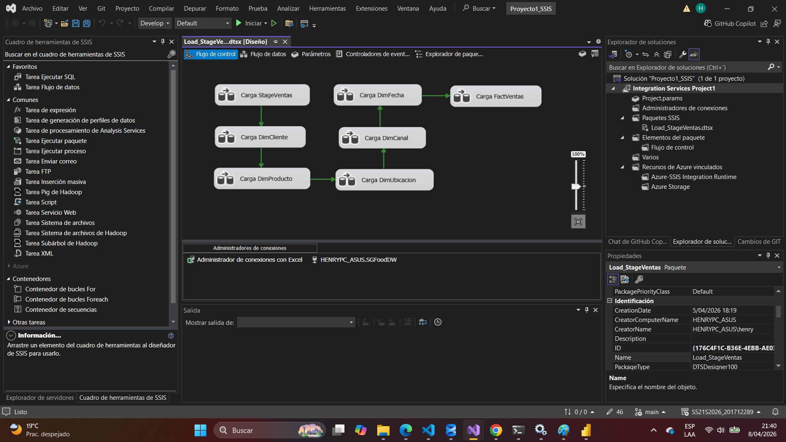
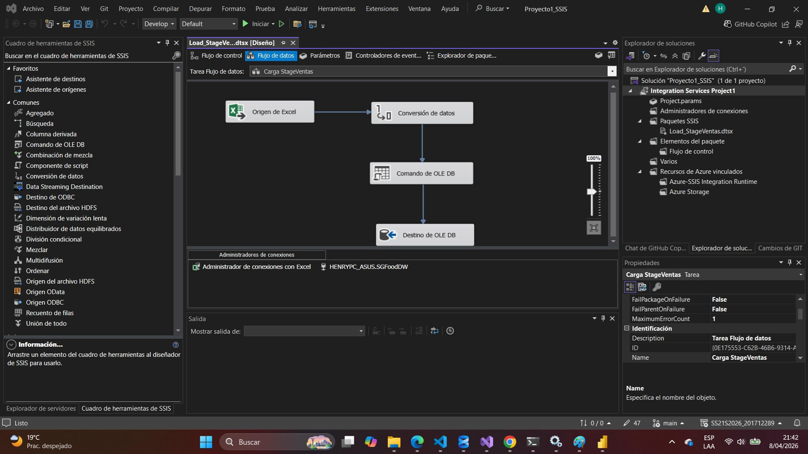
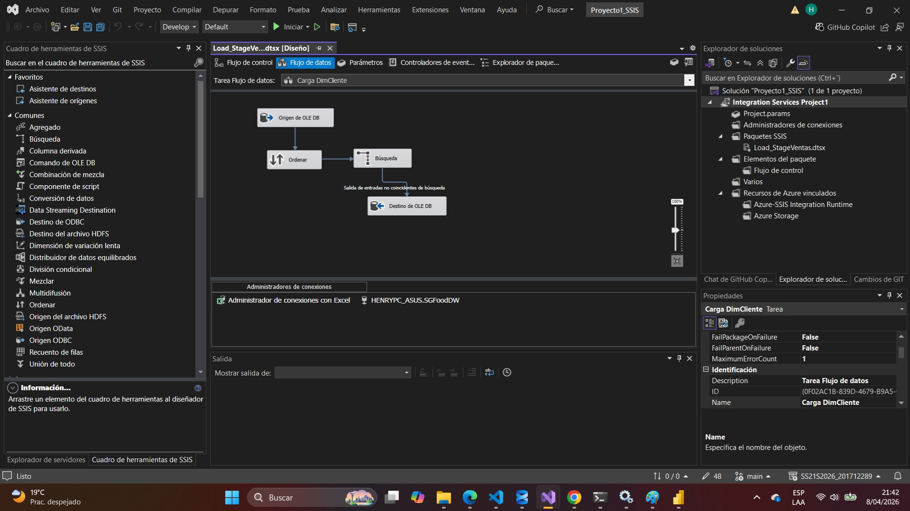
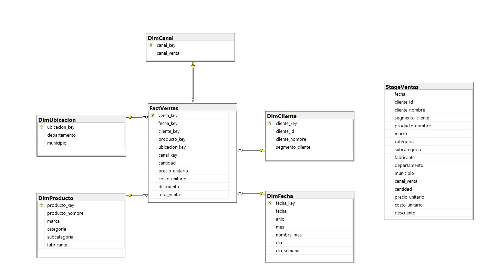
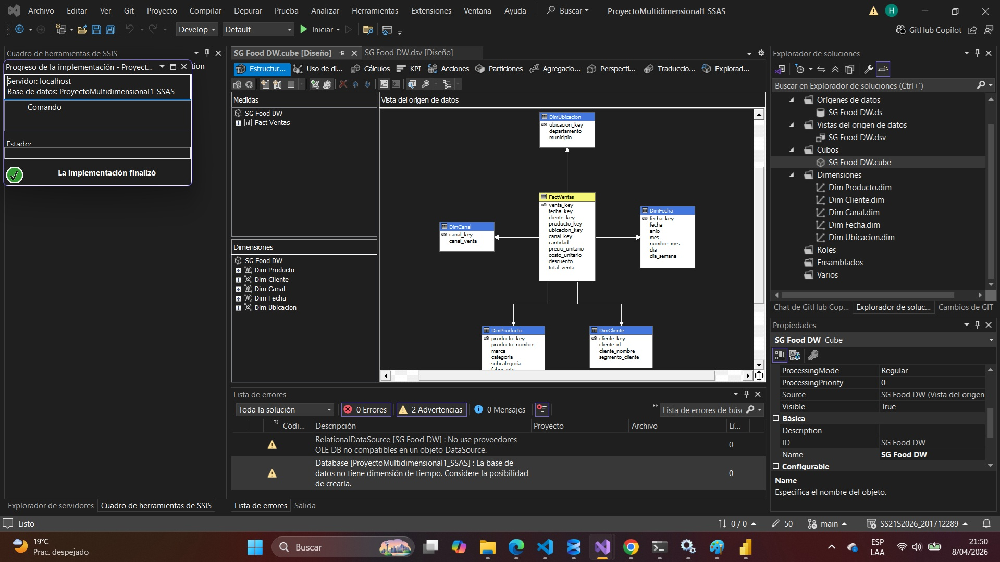
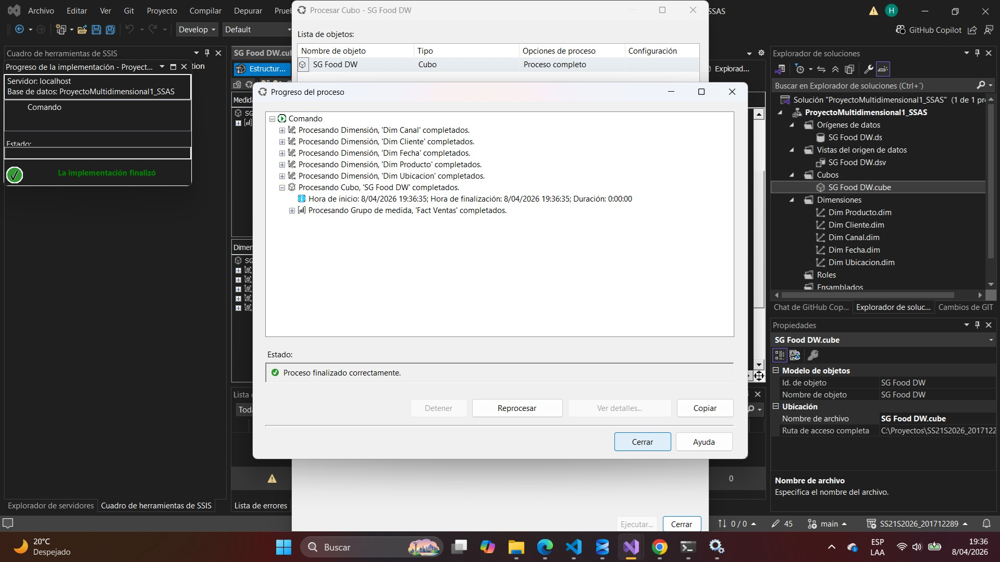
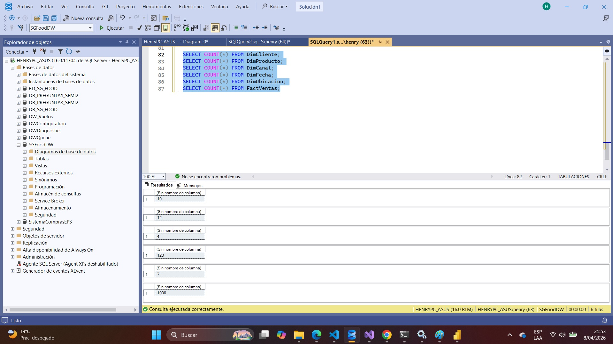
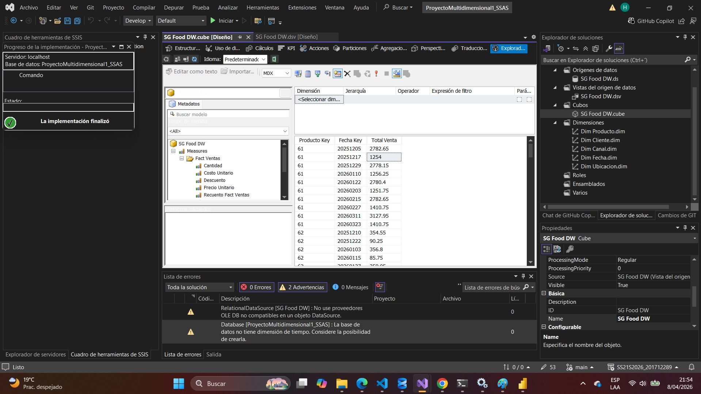
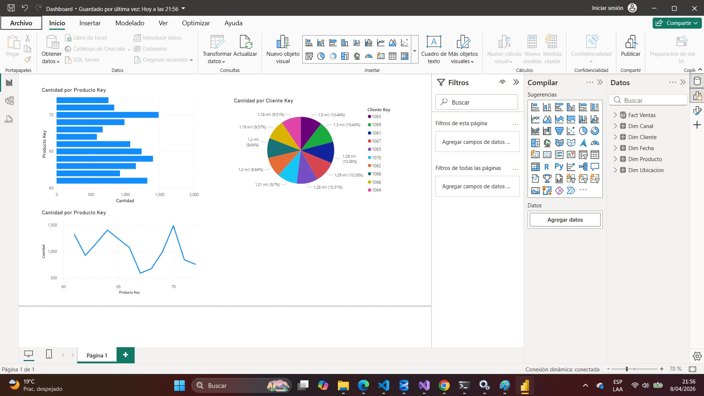

# Proyecto de Business Intelligence – SG Food DW

---

# Descripción del Proyecto

El presente proyecto tiene como objetivo diseñar e implementar una solución completa de Business Intelligence para la empresa SG-Food, con el fin de optimizar el análisis de ventas e inventarios.

La solución integra:

* Proceso ETL con SSIS
* Data Warehouse en SQL Server
* Modelo analítico en SSAS
* Visualización en Power BI

---

# Arquitectura del Sistema

1. Fuentes de datos (archivos y bases de datos)
2. Proceso ETL (SSIS)
3. Data Warehouse
4. Cubo multidimensional (SSAS)
5. Visualización (Power BI)

---

# Fuentes de Datos

Se integraron múltiples fuentes heterogéneas:

* Archivos delimitados (.comp y .vent)
* Archivos Excel
* Bases de datos relacionales

---

# Proceso ETL (SSIS)

Se desarrollaron paquetes en SSIS para:

## Extracción

* Lectura de archivos planos y bases de datos

## Transformación

* Limpieza de datos
* Normalización
* Manejo de valores nulos
* Conversión de tipos
* Generación de claves

## Carga

* Inserción en tablas del Data Warehouse

## Validaciones

* Conteo de registros
* Verificación de duplicados
* Control de errores

---

## Capturas:







---

# Data Warehouse

Se implementó un modelo dimensional tipo estrella:

## Tabla de hechos

* Fact Ventas

## Dimensiones

* Dim Cliente
* Dim Producto
* Dim Fecha
* Dim Canal
* Dim Ubicación

---

## Relaciones

Relaciones establecidas mediante claves primarias y foráneas.

---

## Capturas:



---

# Modelo Analítico (SSAS)

Se implementó un cubo multidimensional con:

## Medidas

* Total Ventas
* Cantidad

## Dimensiones

* Cliente
* Producto
* Fecha
* Canal
* Ubicación

## Jerarquías

* Fecha (Año → Mes → Día)

---

## Capturas:



---

# Procesamiento del Cubo

El cubo fue procesado mediante **Process Full**, cargando los datos desde el Data Warehouse.

---

## Capturas:



---

# Validación y Pruebas

Se realizaron pruebas para verificar:

* Integridad de datos
* Conteo de registros
* Consistencia entre DW y cubo

---

## Consultas SQL utilizadas:

```sql
SELECT COUNT(*) FROM FactVentas;
SELECT COUNT(*) FROM DimCliente;
SELECT COUNT(*) FROM DimProducto;
```

---

## Capturas:





---

# Visualización en Power BI

Se conectó el cubo mediante **Live Connection**.

## Visualizaciones:

* Ventas por producto
* Ventas por año
* Ventas por canal
* Dashboard interactivo

---

## Capturas:



---

# Justificación del Diseño

Se utilizó un modelo estrella debido a:

* Mejor rendimiento en consultas analíticas
* Facilidad de navegación
* Separación clara entre hechos y dimensiones

El uso de SSAS permite consultas multidimensionales eficientes.

---

# Manual de Implementación

1. Ejecutar scripts DDL en SQL Server
2. Ejecutar paquetes SSIS
3. Procesar el cubo en SSAS
4. Abrir Power BI y conectar al cubo

---

# Conclusiones

* Se implementó exitosamente un flujo completo de BI
* Se mejoró el análisis de datos mediante modelado multidimensional
* Power BI permitió visualización interactiva sin reprocesamiento

---
