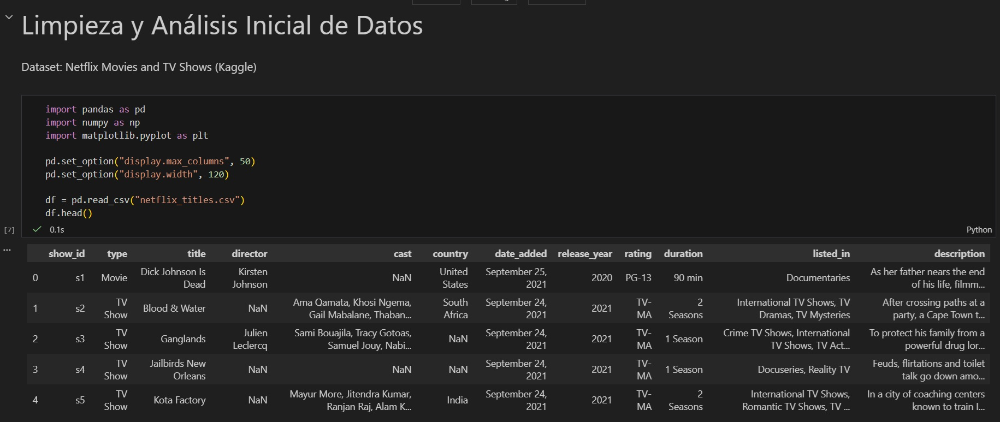
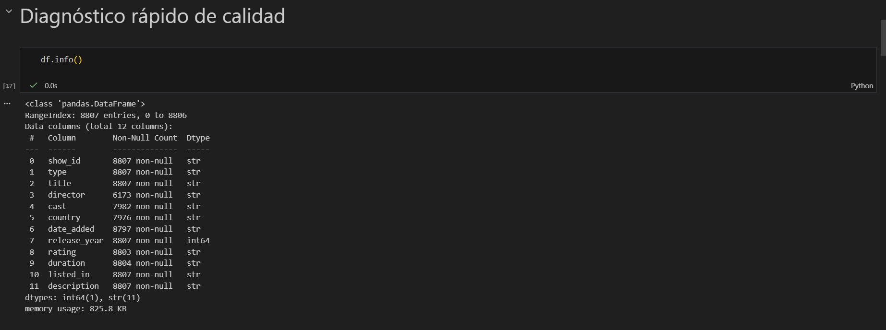
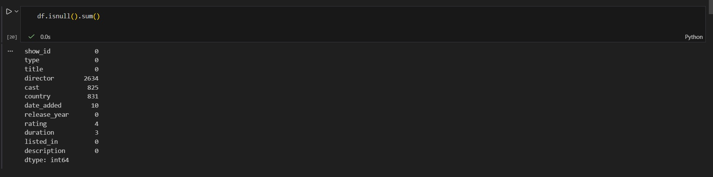
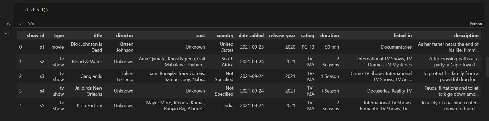
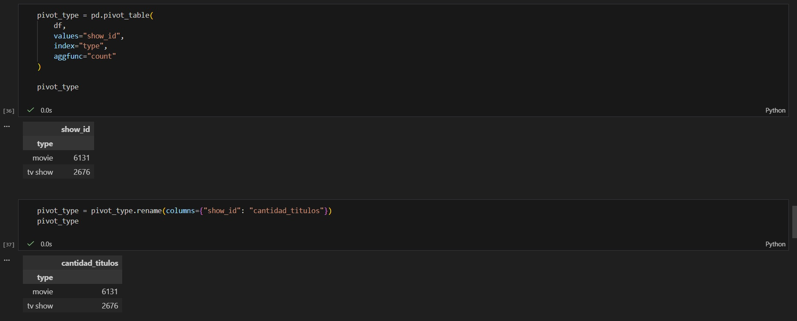
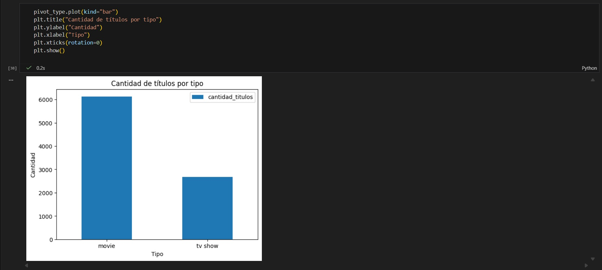

# Tarea 1 - Limpieza y Análisis Inicial de Datos  
## Seminario de Sistemas 2  

**Nombre:** Henry Gabriel Peralta Martinez  
**Carnet:** 201712289  

---

# 1 Objetivos

### Objetivo General
Comunicar resultados de análisis de datos utilizando distintos formatos, incluyendo visualizaciones y documentación técnica clara.

### Objetivos Específicos
- Analizar datos estructurados mediante procesos de preparación, transformación y exploración.
- Evaluar la calidad y pertinencia de la información identificando valores faltantes, duplicados e inconsistencias.
- Aplicar criterios de limpieza y estandarización para mejorar la confiabilidad del dataset.

---

## 1.1 Objetivo SMART

Importar el dataset "Netflix Movies and TV Shows" desde Kaggle en un entorno Python, aplicar un proceso completo de limpieza de datos que incluya eliminación de duplicados, tratamiento de valores faltantes y estandarización de formatos, y generar visualizaciones que permitan analizar relaciones entre variables.

---

# 2. Dataset Utilizado

- **Nombre:** Netflix Movies and TV Shows  
- **Fuente:** Kaggle  
- **Descripción:** Dataset que contiene información sobre películas y series disponibles en Netflix, incluyendo título, tipo, director, elenco, país, fecha de adición, año de lanzamiento, clasificación y duración.

---

# 3. Proceso de Limpieza Aplicado

Se realizó un proceso completo de preparación y limpieza de datos utilizando Python y Pandas.

## 3.1 Eliminación de Duplicados

Se verificó la existencia de registros duplicados utilizando:

```python
df.duplicated().sum()
```

No se detectaron registros duplicados en el dataset.

---

## 3.2 Tratamiento de Valores Faltantes

Se identificaron valores faltantes en las siguientes columnas:

- director  
- cast  
- country  
- date_added  
- rating  
- duration  

### Acciones realizadas:

- Se rellenaron valores nulos en columnas de texto con valores como `"Unknown"` o `"Not Specified"`.
- Se limpiaron espacios en blanco en la columna `date_added`.
- Se convirtió `date_added` a tipo datetime utilizando `pd.to_datetime()` con manejo seguro de errores.
- Se mantuvieron los valores faltantes originales en fecha cuando correspondía (10 registros), ya que estaban vacíos desde el dataset original.

---

## 3.3 Estandarización de Datos

Se aplicaron las siguientes transformaciones:

- Eliminación de espacios en blanco al inicio y final.
- Corrección de espacios múltiples internos.
- Normalización de texto:
  - `type` en minúsculas.
  - `director`, `cast` y `country` en formato título.
  - `rating` en mayúsculas.
- Conversión de la columna `date_added` a tipo fecha (datetime).

Estas acciones mejoran la consistencia, validez y confiabilidad del dataset.

---

# 4. Exploración Mediante Tabla Pivote

Se generó una tabla pivote para analizar la distribución del contenido por tipo (Movie vs TV Show):

```python
pivot_type = pd.pivot_table(
df,
values="show_id",
index="type",
aggfunc="count"
)
```

## Interpretación

La tabla muestra la cantidad total de títulos clasificados por tipo.  
Se observa que existe una mayor cantidad de películas en comparación con series (TV Show), lo cual indica que la plataforma presenta una oferta predominante de contenido cinematográfico.

Este análisis permite comprender la distribución general del contenido dentro del dataset.

---

# 5. Exportación del Dataset Limpio

El dataset procesado fue exportado en formato CSV con el nombre:

```python
dataset_limpio.csv
```

Esto permite reutilizar la información ya depurada para futuros análisis o procesos de toma de decisiones.

---

# 6. Estructura del Repositorio

```
SS21S2026_201712289/
└── Tarea1/
    ├── limpieza_datos.ipynb
    ├── netflix_titles.csv
    ├── dataset_limpio.csv
    ├── README.md
    ├── images/
    └── venv/
```

---

# 7. Capturas

### 1. Dataset Original


### 2. Tratamiento de Valores Faltantes




### 3. Dataset despues de los cambios


### 4. Tabla Pivote



---

# Conclusión

El proceso de limpieza permitió mejorar significativamente la calidad del dataset, eliminando inconsistencias, tratando valores faltantes y estandarizando formatos.  
Las transformaciones aplicadas garantizan una base de datos más confiable y preparada para análisis exploratorios y futuras aplicaciones analíticas.
